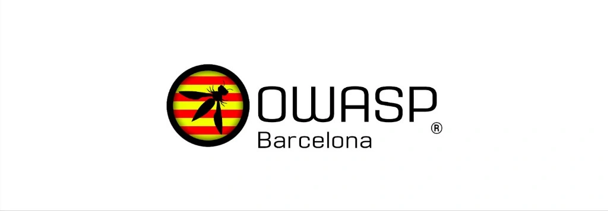

---

layout: col-sidebar
title: OWASP Barcelona
tags: barcelona
level: 0
meetup-group: 
region: Europe
country: Spain

---

# Benvingut/da!
Welcome to the OWASP Barcelona Chapter page. We organize events to share interesting topics regarding all things cybersecurity. As Barcelona is an international hub, talks will be given in English. However, we will accommodate as best we can for Spanish and Catalan at all talks.

## Speaking at OWASP Barcelona Chapter Events
We have an open call for speakers at our events. If you would like to present a talk on Application Security at our events, please review and agree to the [OWASP Speaker Agreement](/www-policy/legal/speaker-agreement) send the following to either [Conor Rynne](mailto:conor.rynne@owasp.org) or [Andres Galarza](mailto:andres.galarza@owasp.org):

- Proposed talk title
- Abstract
- The language of the presentation
- Written script for the talk in either English or Spanish. It does not need to be word-for-word aligned with what you say on the day, but should be detailed enough that people who must resort to reading can follow.

## Participation
The Open Worldwide Application Security Project (OWASP) is a nonprofit foundation that works to improve the security of software. All of our projects, tools, documents, forums, and chapters are free and open to anyone interested in improving application security. 

Chapters are led by local leaders in accordance with the [Chapter Leader Handbook](/www-policy/rules-of-procedure/chapter-handbook). Financial contributions should only be made online using the authorized online donation button.

Everyone is welcome and encouraged to participate in our [Projects](/projects), [Local Chapters](/chapters), [Events](/events), [Online Groups](https://groups.google.com/a/owasp.com/), and [Community Slack Channel](https://owasp.slack.com/). We especially encourage diversity in all our initiatives. OWASP is a fantastic place to learn about application security, to network, and even to build your reputation as an expert. We also encourage you to be [become a member](/membership) or consider a [donation](/donate) to support our ongoing work.

